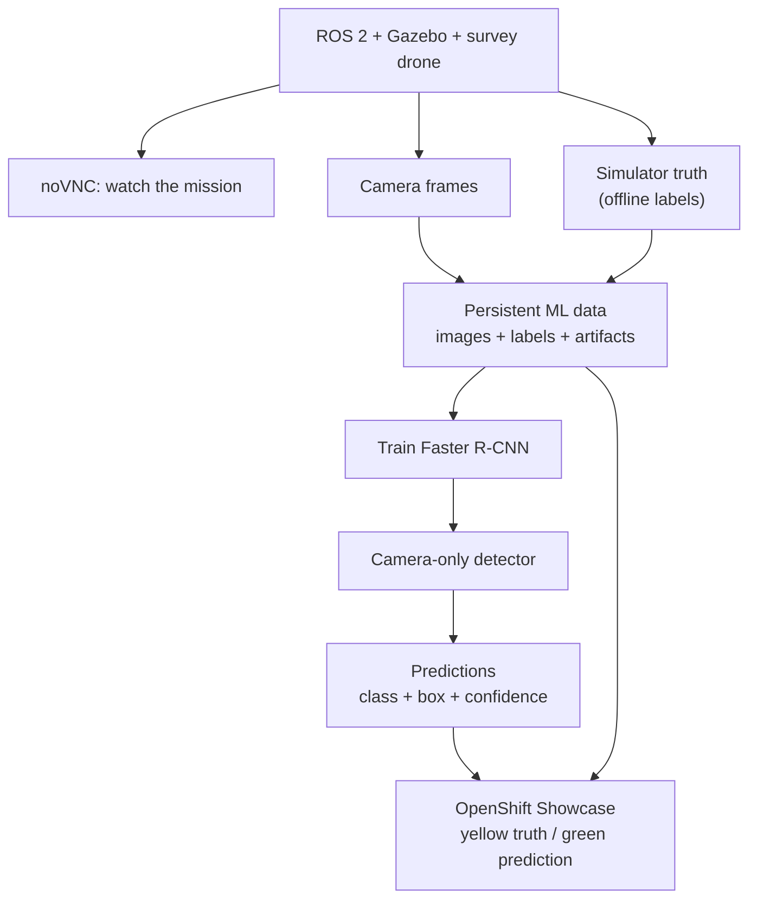

# ROS Farm Survey Drone Demo

This is a farm-surveillance demo built with ROS 2, Gazebo, and an autonomous
survey drone. The drone flies through a simulated farm, captures camera images
of assets such as silos, sheds, fields, greenhouses, and water tanks, and uses a
trained Faster R-CNN model to classify what it sees. The ML pipeline records the
images and labels, trains the detector, and stores model predictions with
confidence scores. The OpenShift Showcase lets you compare simulator ground
truth with camera-model predictions directly on the captured images.
When deployed, users can watch the mission in Gazebo through noVNC, then open
the Showcase to inspect the dataset, labels, predictions, and model artifacts.



The important boundary is that simulator truth creates labels and supports
offline comparison; the deployed detector and mission observer use camera
predictions at runtime.

## Prerequisites

For the full OpenShift ML demo, have these ready before starting:

- `git`, `oc`, and Helm 3;
- an OpenShift cluster where you can create namespaces, Deployments, Jobs, PVCs,
  and Routes;
- a container registry and credentials with permission to push and pull images;
- a Linux build host with Podman and access to the configured base images;
- an NVIDIA GPU node with the NVIDIA device plugin for model training and
  inference;
- a ReadWriteOnce storage class with at least 10 GiB available for ML data;
- local permission to create ignored `values.yaml` and `versions.env` files.

The cluster path also needs network access from the ML namespace to the farm
release's Zenoh service. A local-only run additionally requires ROS 2 Jazzy,
Gazebo Sim, `rosdep`, and `colcon`; it does not provide the OpenShift Showcase.

You will need to supply your own registry names, image tags, OpenShift login,
and registry login. The repository does not include captured datasets or trained
model weights; a clone or fork creates those by running its own missions and
training job.

The demo scenario contains:

- a well and elevated water tank;
- an item-storage silo;
- a cattle shed;
- a produce barn;
- a crop field and greenhouse;
- farmhouse, tractor, fencing, and crop-row scenery.

The seven detection types are `well`, `storage_silo`, `cattle_shed`, `produce_barn`, `crop_field`, `greenhouse`, and `water_tank`. Scenarios are configured in [`config/scenarios.yaml`](config/scenarios.yaml): `inventory`, `crops`, `water`, and `all`.

## Repository layout

- `worlds/` — farm world definition.
- `ros_ws/src/drone_observer_msgs/` — reusable truth, detection, and survey action interfaces.
- `ros_ws/src/drone_observer/` — waypoint controller, rendered-camera subscriber, truth publisher, and observer action server.
- `scripts/launch-world.sh` — Gazebo startup plus ROS-Gazebo image and pose bridges.
- `components/simulation-world/` — Gazebo farm world image definition.
- `components/drone-observer/` — ROS observer image definition.
- `drone-ml-pipeline/` — ML pipeline overview and roadmap.
- `helm/drone-demo/` — OpenShift/Kubernetes deployment for the farm demo.
- `helm/drone-ml-pipeline/` — persistent ML data, training, labeling, validation, and showcase chart.

## OpenShift clone/fork quickstart

The supported reproducible path uses two independent Helm releases:

- `farm-drone` — Gazebo, ROS, the observer, noVNC, and disposable mission evidence.
- `farm-drone-ml-data` — the retained ML PVC, datasets, model checkpoints, detector,
  and read-only Showcase.

Log in to both OpenShift and the registry before continuing. The image build uses
the separate Linux build host described above.

Choose namespaces that you own. The ML values must refer to the demo release's
Zenoh service; the commands below use the documented defaults:

```bash
export DEMO_NAMESPACE=farm-drone
export ML_NAMESPACE=farm-drone-ml
export DEMO_RELEASE=farm-drone
export ML_RELEASE=farm-drone-ml-data

oc whoami
helm lint helm/drone-demo --values helm/drone-demo/values.yaml.example
helm lint helm/drone-ml-pipeline --values helm/drone-ml-pipeline/values.yaml.example
```

### 1. Build and publish the farm images

On the build host, create the ignored local version file, set a registry and tag,
then build and publish the world and observer images. The observer image must
contain the ROS workspace, camera detector, and dataset recorder.

```bash
cp versions.env.example versions.env
$EDITOR versions.env
source versions.env
./scripts/build-images.sh all
podman push "${DRONE_WORLD_IMAGE}"
podman push "${DRONE_OBSERVER_IMAGE}"
```

Set `images.world` and `images.observer` in
`helm/drone-demo/values.yaml` to those published image names. Keep the local file
uncommitted. The `zenoh` and `novnc` images in the example values must also be
available to your cluster; replace them with registry-accessible equivalents when
using a private fork.

### 2. Install both releases

Copy the safe examples to ignored local values files. Update the ML values so
`demo.namespace` matches `DEMO_NAMESPACE`, and set `demo.zenohService` to
`${DEMO_RELEASE}-ros-drone-demo-zenoh` when using a different release name.

```bash
cp helm/drone-demo/values.yaml.example helm/drone-demo/values.yaml
cp helm/drone-ml-pipeline/values.yaml.example helm/drone-ml-pipeline/values.yaml

helm upgrade --install "${DEMO_RELEASE}" helm/drone-demo \
  --namespace "${DEMO_NAMESPACE}" --create-namespace \
  --values helm/drone-demo/values.yaml --wait

helm upgrade --install "${ML_RELEASE}" helm/drone-ml-pipeline \
  --namespace "${ML_NAMESPACE}" --create-namespace \
  --values helm/drone-ml-pipeline/values.yaml --wait
```

Check that the workloads and retained storage are ready:

```bash
oc get pods,pvc -n "${DEMO_NAMESPACE}"
oc get pods,pvc -n "${ML_NAMESPACE}"
SHOWCASE_HOST=$(oc get route -n "${ML_NAMESPACE}" \
  -l app.kubernetes.io/component=perception-showcase \
  -o jsonpath='{.items[0].spec.host}')
echo "http://${SHOWCASE_HOST}"
```

The Showcase initially has no datasets. Open the printed URL after completing the
capture and model steps below.

### 3. Capture a labeled training flight

Enable the recorder with the observer image you built. It reads camera frames and
simulator truth to create offline labels; truth is not used by the camera detector.

```bash
helm upgrade "${ML_RELEASE}" helm/drone-ml-pipeline \
  --namespace "${ML_NAMESPACE}" --reuse-values \
  --set recorder.enabled=true \
  --set recorder.image="${DRONE_OBSERVER_IMAGE}" \
  --set recorder.scenario=all \
  --set recorder.seed=flight-v1 \
  --set recorder.outputDir=/data/perception/datasets/flight-v1 \
  --wait

DEMO_POD=$(oc get pod -n "${DEMO_NAMESPACE}" \
  -l app.kubernetes.io/name=ros-drone-demo-observer \
  -o jsonpath='{.items[0].metadata.name}')
oc exec -n "${DEMO_NAMESPACE}" "pod/${DEMO_POD}" -- bash -lc \
  'source /opt/drone/scripts/ros-env.sh &&
   source /opt/drone_ws/install/setup.bash &&
   ros2 action send_goal /drone/survey drone_observer_msgs/action/SurveyMission
   "{mission_id: flight-v1, scenario: all}" --feedback'

helm upgrade "${ML_RELEASE}" helm/drone-ml-pipeline \
  --namespace "${ML_NAMESPACE}" --reuse-values \
  --set recorder.enabled=false --wait
```

Refresh the Showcase. The new flight should contain images, projected truth
labels, and a manifest. Capture additional scenarios or episodes before training
so that one complete episode can be held out for validation.

### 4. Train and deploy a detector

The complete capture, curation, GPU training, and detector rollout procedure is
documented in [`docs/REPRODUCIBLE-SETUP.md`](docs/REPRODUCIBLE-SETUP.md). It keeps
the ML PVC independent from the disposable farm release. Training produces a
PyTorch Faster R-CNN checkpoint; ONNX is archived and is not required.

After training, set the detector image to your published observer image and point
`detector.modelPath` at the checkpoint on the ML PVC. Enable the detector and, for
prediction-aware capture, enable the recorder with the same observer image.

### 5. Validate in the Showcase

Run another mission with detector and recorder enabled, then stop the recorder.
The Showcase will show the captured dataset and overlay:

- yellow boxes for simulator ground truth;
- green boxes for camera-model predictions;
- confidence percentages and prediction counts.

This visual comparison is the primary demo validation. The optional perception
validator can additionally write numeric precision/recall results; it is not
needed to inspect the images.

## Local run

Use a ROS 2 Jazzy environment with Gazebo Sim and build the workspace:

```bash
source /opt/ros/jazzy/setup.bash
rosdep install --from-paths ros_ws/src --ignore-src -r -y
colcon build --base-paths ros_ws/src
source install/setup.bash
./scripts/run-local.sh
```

In another shell, submit a mission:

```bash
source install/setup.bash
./scripts/submit-mission.sh all
```

Evidence and `report.json` are written below `artifacts/` by default.

The farm world contains the moving `observer_drone` model and a downward-facing Gazebo camera sensor. The world image bridges rendered camera frames to `/drone/camera/image_raw` and exposes `/world/farm_survey/set_pose`; the observer uses that service to keep the visible drone model synchronized with each waypoint. Evidence capture fails if no rendered frame is available. The logical `north_access_restriction` is also shown as a translucent, visual-only volume in Gazebo, while the latest `/drone/mission_path` is rendered as a thick yellow flight ribbon with waypoint markers. The GUI opens in an elevated farm overview so the route and detour are visible. Neither visual adds collision geometry.

The survey action runs an explicit mission state machine: `TAKEOFF`, `TRANSIT`,
`INSPECT`, `RETURN`, `LAND`, and `COMPLETE`. Cancellation or a movement/camera
failure enters `EMERGENCY` and attempts a return-to-home and landing sequence.
The current state is also published on `/drone/mission_state`.

Each accepted mission publishes its complete planned 3-D route on
`/drone/mission_path` as a `nav_msgs/Path`, including takeoff, survey
waypoints, return, and landing. The same route is recorded in the mission's
`report.json` under `planned_route` for downstream navigation and audit tools.
The navigation layer validates every route against the configured geofence and
publishes normalized execution progress on `/drone/navigation_progress`. Planar
motion is executed by Nav2's planner/controller stack through the
`NavigateToPose` action, while the existing kinematic adapter preserves smooth
3-D altitude changes. The farm map publisher supplies a transient-local
`/map` costmap, and the configured axis-aligned `no_fly_zones` are represented
as occupied map cells without changing the farm world or its target
coordinates.
Runtime obstacle centers may be supplied as a `geometry_msgs/PoseArray` on
`/drone/dynamic_obstacles`. Each pose is expanded using the configured
`dynamic_obstacles` dimensions, stale feeds expire automatically, and an active
mission is converted into Nav2 obstacle-layer scan data so Nav2 can replan
around newly blocked segments. Replan events are recorded in the mission report
for verification.

The drone starts and lands at the dedicated `DRONE STATION` deck at
`farm_map` coordinates `(10, 16)`. The observer and kinematic flight node use
the same home coordinates, so every normal or emergency return ends at that
deck rather than inside the crop field.

The visible Gazebo model follows the interpolated flight pose continuously,
with configurable acceleration (`DRONE_ACCELERATION_MPS2`) and cruise speed,
so waypoint transitions are rendered as smooth flight rather than teleports.

## OpenShift details

The world image contains only the farm world and Gazebo runtime additions. The
observer image contains the ROS package, mission logic, camera detector, and
dataset recorder. The full build, deployment, capture, training, and Showcase
flow is in [`docs/REPRODUCIBLE-SETUP.md`](docs/REPRODUCIBLE-SETUP.md).

The example enables the private noVNC viewer. Forward it locally instead of exposing
the VNC service publicly:

```bash
oc port-forward -n farm-drone svc/farm-drone-ros-drone-demo-novnc 6080:8080
```

Open `http://127.0.0.1:6080/vnc.html` to view Gazebo. Survey evidence is stored on
the observer PVC and can be downloaded after a mission with:

```bash
POD=$(oc get pod -n farm-drone \
  -l app.kubernetes.io/name=ros-drone-demo-observer \
  -o jsonpath='{.items[0].metadata.name}')
oc cp -n farm-drone "$POD:/artifacts/<mission-id>" ./artifacts/<mission-id>
```

Never commit local `values.yaml`, `versions.env`, `.env`, cloud credentials,
registry credentials, private keys, or other sensitive files. The committed
example files contain only public placeholder configuration.
